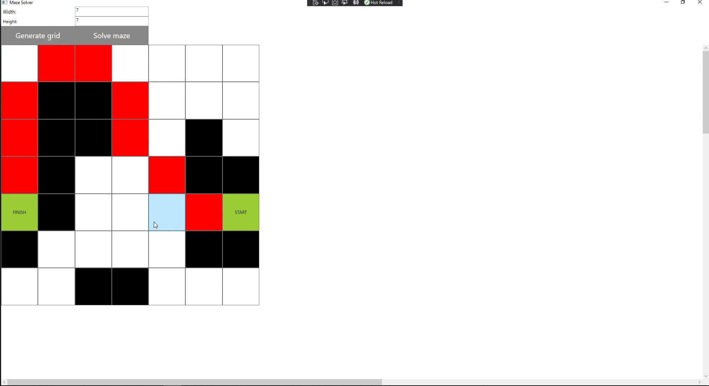

# Maze solver application
Basic WPF .NET5 application on architecture MVVM

## Image

## Algorithm
For maze solving is implemented search algorithm A*.

## Future
Add algorithm for genering labyrints.
